[English Version](./readme_en.md)

[中文版](./readme_zh.md)

1. 安装所需库，这个库比较特殊，其他库自行安装解决
``pip install flask-migrate``

2. 迁移三部曲(用来迁移数据库)

``flask db init ``

``flask db migrate``

``flask db upgrade``

最后会生成一个migrations文件,并且数据库中会多两张表

修改html路径，

发送验证码：
1. 安装flask库:
    ``pip install flask-mail``    
2. 创建flask-mail 然后在config中配置邮箱信息，在exts中创建，app中引用并初始化，然后在auth.py中创建视图函数
3. 先创建/mail/test，并成功测试邮箱。然后创建/captcha/email视图函数实现发送邮箱的功能，但是还是有欠缺。
4. 将验证码存储到数据库(更改models),然后再走一下三部曲,ajax返回json格式字符串
    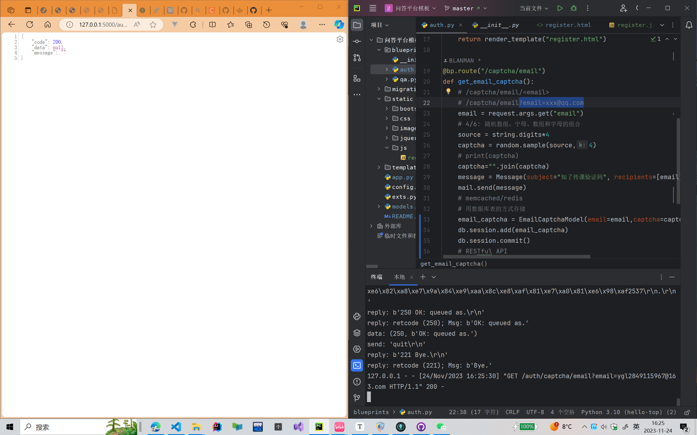
    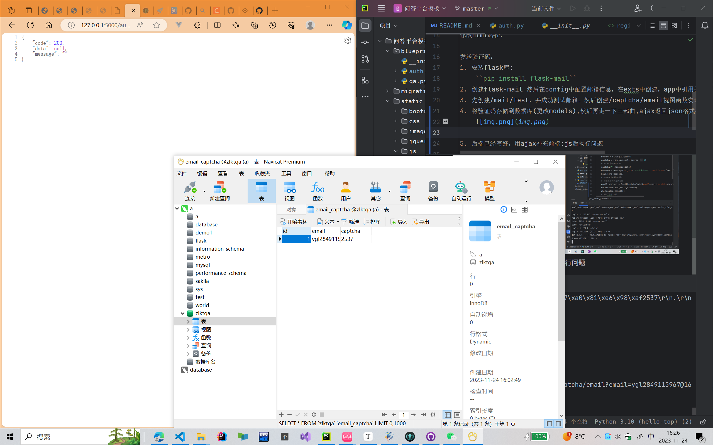
5. 后端已经写好，用ajax补充前端:js后执行问题\
6. 补充验证码的倒计时功能

表单验证功能：
1. 安装库：
``pip install flask-wtf``
2. 创建forms.py，验证邮箱以及验证码
3. 安装包：
``pip install email_validator``

登录页面前端实现完成,修改登录页面.  
登录页面后端实现：
    - 修改forms,增加登录数据库表
    - 修改auth
    - 设置session，在config中假如secert_key
    - 登录功能实现

两个钩子函数：
- 在app.py中增加了两个钩子函数
- 登录和非登录状态切换：

关于签出页面的视图函数：

做了关于发布问答的视图函数和html页面：
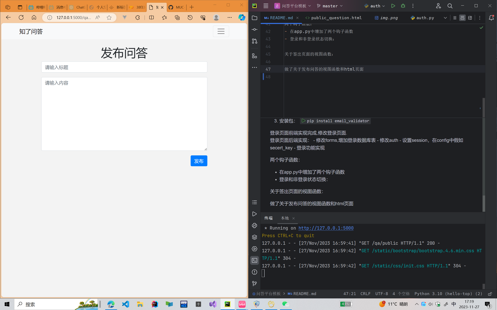
发布问答的后端功能的实现:
- 修改models
- 增加了decoreators.py函数,用来新建装饰器.作用是验证用户是否登录,如果没有登录就不可以发布问答


首页问答模板渲染：
- 修改了index.html，并且在qa中修改了视图函数
- 修改了avatar.jpg
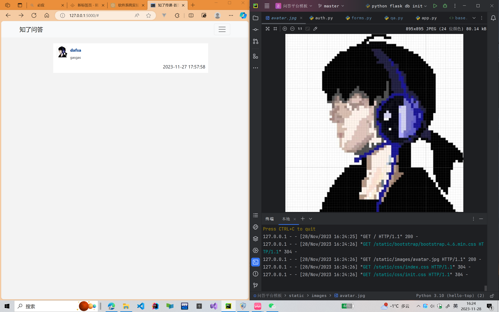


问答列表页渲染：
- 修改detail.html
/* 在pycharm中ctrl+alt+l可以格式化*/
- 修改qa，增加问答详情的视图函数
- 修改index.html，实现点击跳转到detail.html
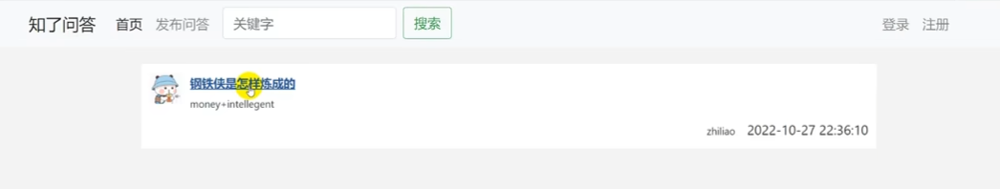

写完detail.html之后我发现网页一直报错，加载不到css文件，
但是我在对比过视频和index.html之后发现代码是没有问题的，所以我调试了一下程序
结果如下:

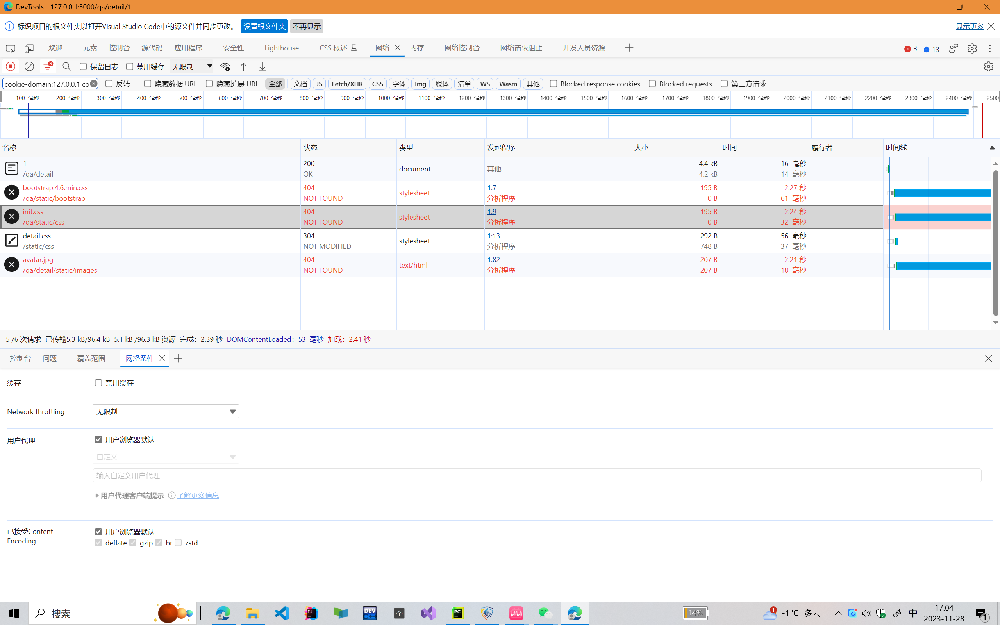
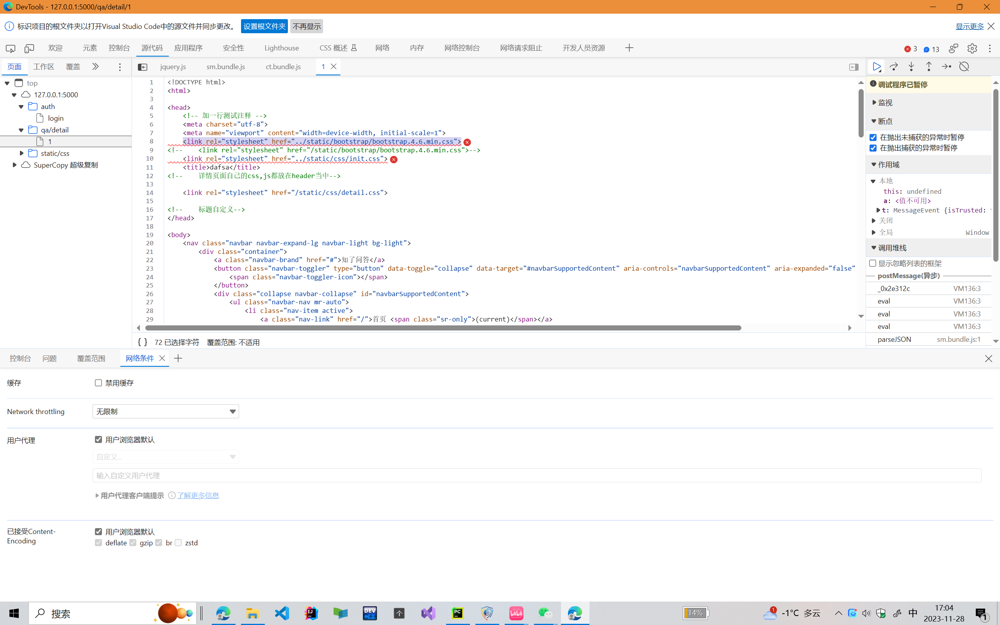
根据后两张图片我们可以看出，这里的detail.css文件被成功获取,
但是其他应该在base.html中的文件却没有被获取，所以问题应该是：
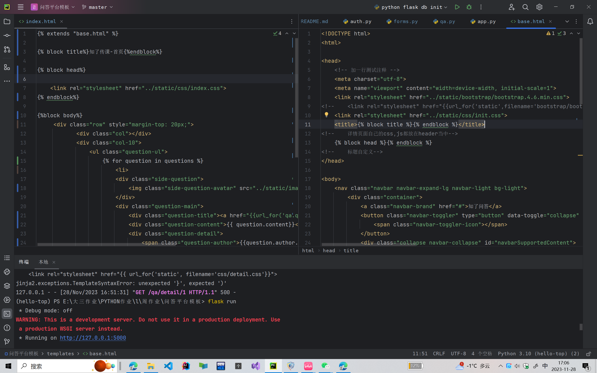
我在base.html中没有使用url_for的语法全局查找文件，而是使用了相对路径,于是detail进入了index的下一级路径导致base.html中的文件没有被导入成功

修改后运行正常:
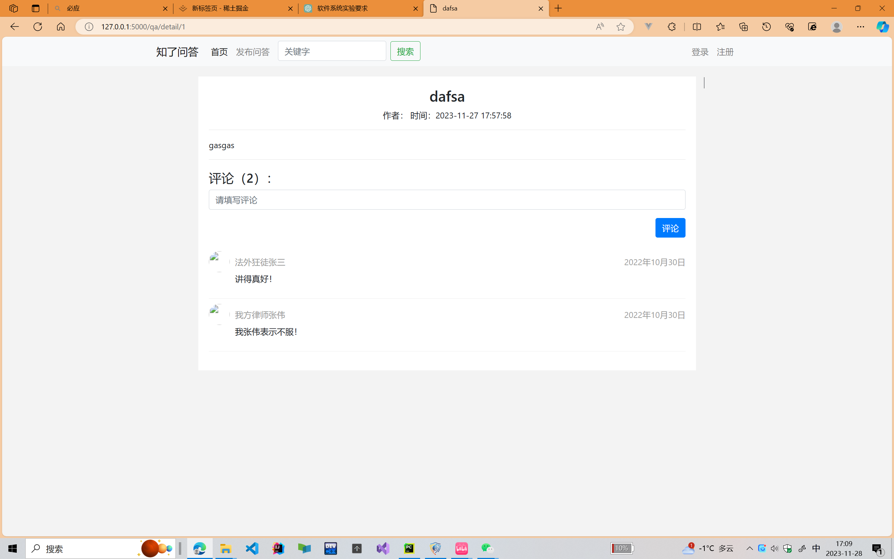


答案模型创建:
写到这里不知道有没有人和我一样在创建数据库表的时候一直报错，一直显示question表已存在,但是删除questio表格之后又会出现新的问题,总之非常麻烦
在经历了删除数据库，从git拉去上一次提交的代码之后，我直接删除了数据库，删除了migrations文件重新建立了一次表，这应该是目前最有效的解决办法。
此处还有一个问题，应该是老师写错了：
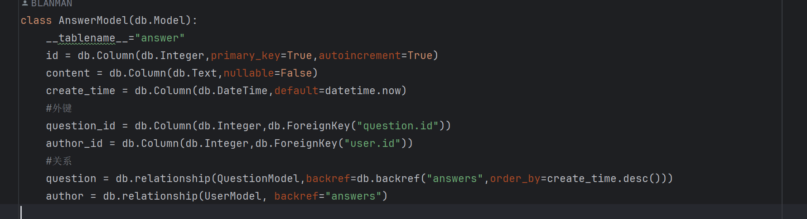
最后的author应该是对应UserModel表

在修改完成后发现服务器一直报错，后来发现是以为hash加密后的password会超过定义的100字符，所以修改modles:
```commandline
class UserModel(db.Model):
    # ... 其他字段保持不变
    password = db.Column(db.String(255), nullable=False)
    # ... 其他字段保持不变
```
然后
```commandline
flask db migrate -m "Increase password field length"
flask db upgrade
```
像前面视频里边说的一样直接用navicat改也可以

再次发现此处少了一个return导致提交问答这一模块直接失效，不能提交get请求也不能提交post请求。只要点击提交问答就会导致服务器错误，不管你登不登陆
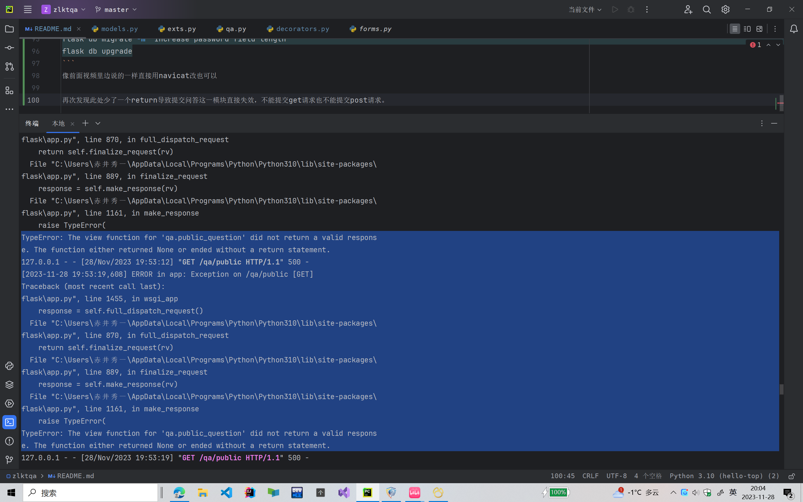
修改错误如下:
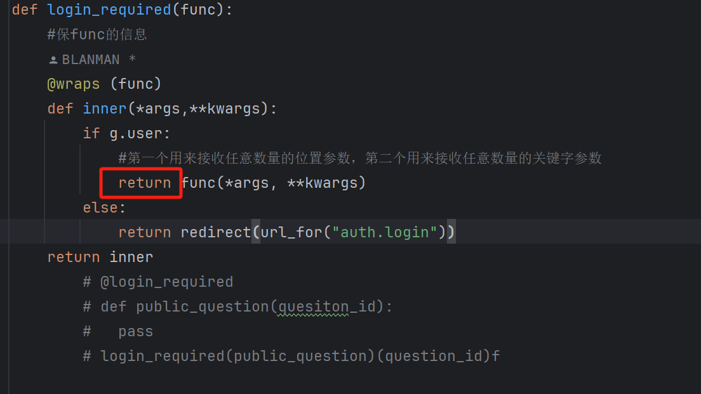


发布答案功能完成:
- 后端：表单校验和视图函数，post请求的新写法
    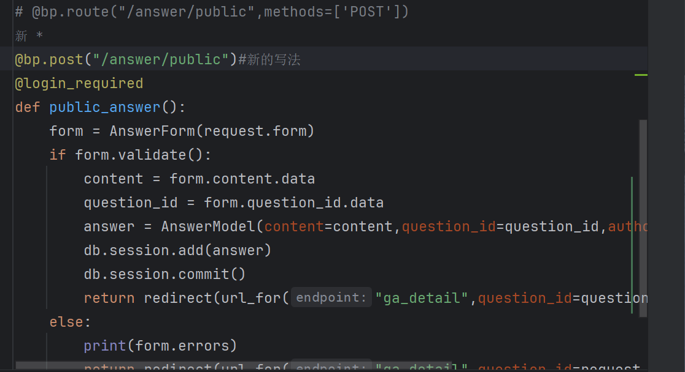
- 前端：修改detail，答案列表的渲染

搜索功能的实现：
- 后端修改qa：
- 前端修改base

完结撒花，最后一点东西不想听了，以后想听再说。


- [ ] 完善commit,梳理以前提交的错误
- [x] 写一篇英文版的markdown


到此，这个项目的代码已经全部写完,如果对你有帮助的话可以给我一个star
- 视频地址：
[2023版-零基础玩转Python Flask框架-学完可就业](https://www.bilibili.com/video/BV17r4y1y7jJ?p=41&vd_source=1a0df84062fc3afe05ddb5436ffce988)
- github地址： 
[github](https://github.com/MUC-NBM/zlktqa)
